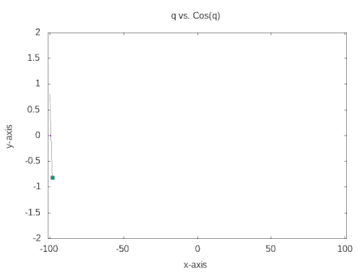

[Home](./) \| [Prev. Page](./eom.html) \| [Resources](./conclusion.html)

<iframe width="560" height="315" src="https://www.youtube-nocookie.com/embed/9Q6HDpvbook" title="YouTube video player" frameborder="0" allow="accelerometer; autoplay; clipboard-write; encrypted-media; gyroscope; picture-in-picture" allowfullscreen></iframe><br>

## Content

* 1. Introduction 2. The 'Hellow World!' 3. Working Equations 4. Phase space 5. Final code 6. Appendix-I(Derivations) 

## Introduction

Here we are at the very end of this animation blog. Now we are equipped with a lot of features of GnUPlot. The last thing I wanted to show, how to animate from a dat or txt file. You may be able to plot a static graph from files but animating from a file requires reading data line by line. at first, we will go through a simple example, which will show all the essence of 'animation from a data file' then we will move on to simulate **Kapitza Pendulum**.

## The 'Hello World!' - Once Again

Here I have generated a data file <a href="./data_gen.dat" download>'data_gen.dat'</a> using a Fortran program. You may see it [here](./code.html#dat).

The code for GNUPlot is simple and self-explanatory ~

```
reset
set term qt
unset key
set title 'Test'
set xlabel 'x-axis'
set ylabel 'y-axis'
set yrang[-2:2]
set xrange[-101:101]
n=2000
do for[i=1:n]{
plot 'test.dat' every ::1::i w l ls 1, \
     'test.dat' every ::i::i pt 5
}

reread
```

> In the plot command, first line is meant to plot from the first line of data_gen.dat upto \\(i^{th}\\) line. The output must explain the need. The second line of plot is the point which is guiding the curve in this GIF.



## Working Equations for Kapitza Pendulum

The Lagrangian is 
\\[ L =  \frac{m}{2}\left[ z_0^2 \omega^2 sin^2 (\omega t)+l^2 \dot{\theta}^2 + 2z_0 l \omega \dot{\theta} sin(\omega t) sin \theta \right] - mg\left( z_0 cos(\omega t) + l cos\theta \right) \\]

Then it's easy to show, ( Details are [here](#appendix-i-derivations) ) the equation of motion is:
\\[ \ddot{\theta} + \frac{sin \theta}{l} \left( z_0 \omega^2 cos (\omega t) - g \right) \\]

As we've done before

\\[ \dot{\theta} =\Theta \\]
\\[\dot{\Theta} = -\frac{sin \theta}{l} \left( z_0 \omega^2 cos (\omega t) - g \right)\\]

> Here, \\(z = z_0 cos (\omega t)\\), z is the coordinate of the base while \\(\omega\\) is the frequency. \\(\theta\\) is the angle between baseline and pendulum. \\(l\\) is the length of the pendulum.

> The Fortran code to solve the equations can be found [here](./code#kp). You may just download the generated <a href="./kp.dat" download>file.</a>

## Look at phase space

Before we simulate the Pendulum itself, let us simulate the phase space portrait. One can always do a static plot `p 'kp.dat' u 2:3 w l`

But it's boring. In the previous example, we've seen how to do animation from data files. So you may try it yourself. Although I'm leaving the [code](./code#kp-phase) that creates a GIF for you. This code may take longer in the first run as the number of frames is large.

<iframe width="560" height="315" src="https://www.youtube-nocookie.com/embed/a4Mj1hEge2Y" title="YouTube video player" frameborder="0" allow="accelerometer; autoplay; clipboard-write; encrypted-media; gyroscope; picture-in-picture" allowfullscreen></iframe><br>

## The Kapitza Pendulum

Here, we not only need to read the data line by line from the file but also need to store them in variable since we need them to use in drawing bobs and anchor, as we have done before. For this, I did a little trick here. I've plotted first and second column with white colour(see line no. 44), meanwhile, store them into variable. The output will look like as the cover of this page. So, here we go~

<script src="https://gist.github.com/arabindo/f62f6be0652b9ea6b1112653b19c7e91.js"></script><br>

## Configuration Space

You may try to plot configuration space as well! That is column 1 vs Column 2.

<iframe width="560" height="315" src="https://www.youtube-nocookie.com/embed/5X_NmXceJtE" title="YouTube video player" frameborder="0" allow="accelerometer; autoplay; clipboard-write; encrypted-media; gyroscope; picture-in-picture" allowfullscreen></iframe><br>

## Appendix-I (Derivations)

For the derivation of Lagrangian and EOM, you may check out my [blog post](https://arabindo.github.io/blog/2021/kapitza-pendulum/) on Kapitza pendulum

[Home](./) \| [Prev. Page](./eom.html) \| [Resources](./conclusion.html)
