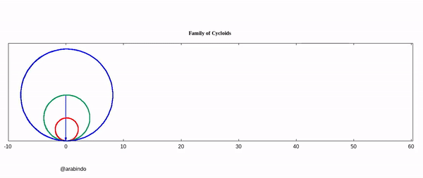
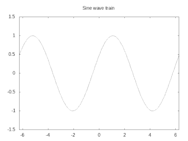

> **DISCLAIMER:** The ["Animate a Cycloid"](#tracing-a-cycloid) topic is developed step by step. There is a some repeatation of large code blocks. So it may seems to be lengthy but it is actually not!

<center> <h2> Table of Contents </h2> </center>

|**Simple Animation**| **Animate simple physical system** | **Animate using Data file** | **Conclusion** |
|:---|:---:|:---:|:-----:|
|[1. Introduction](#introduction) | [1. Animate a system from numerical solution of EOM](./eom) | Coming Soon! | Coming Soon! |
|[2. Why GNUPlot](#why-gnuplot)   | [2. Appendix- On RK4 method](./eom#appendix) | 
|[3. The Final Goal](#the-final-goal)                            |
|[4. Scripted GNUPlot](#scripted-gnuplot)			  |
|[4.1. The 'Hello world!'](#your-first-animation---the-hello-world)|
|[5. Animate a Cycloid](#tracing-a-cycloid)|
|[5.1. Final script for the Cycloid](#the-final-script)|
|[6. Be an active learner](#be-an-active-learner)|
|[7. A Bonus Project](#a-bonus-project)|

# Introduction

Visualizing a system by plotting a graph is always of great interest for practising professionals in any stream. But the advancement of technology now allows us more than just plotting. Nowadays “Just plotting” is an old fashion. Either it is teaching or presenting an idea in front of the audience, or just for self-learning, it is always a good idea to animate the system somehow. Or you may just want to plot a time-varying graph. Here I’ll discuss techniques and tricks for the same.

## Why GNUPlot

GNUPlot is simple, elegant and great for `First and Fast` learning. Although there are several packages/software, some are too advanced, we will be using good old GNUPlot. My personal believe (fortunately, many people agree to that) is that if you can learn one such package, the skill is transferable. So you can go on learning as per your preference. 

## The Final Goal

I believe, most of you is already equipped with Lagrangian and Hamiltonian formalism. So the idea is to show the technique to produce GIFs(Graphics Interchange Format) and then to show how to simulate a simple system when the Lagrangian(or Hamiltonian) of the system is is given a priori. After the second half, the reader must be able to animate simple systems of their choice. In a later post, I'll also show how to do animation from a data file. That will give you a wing to use GNUPlot with any other programming language. Although GNUPlot terminal can be linked to other programming languages, let's don't make thing complicated with that technical jargon. Now it's enough of hunky-junky. Let's get into the topic with the so-called 'hello-world GNUPlot script for the animation.

# Scripted GNUPlot

Unlike writing command directly in the terminal, we can create a simple text file listing all the commands. Save it with an extension '.gnu'(say, cos.gnu). Then from the terminal just type `gnuplot cos.gnu` and hit `Enter`. The file may contain the following
```gnuplot
reset
set term qt
set xrange[-2*pi:2*pi]
set yrange[-1.5:1.5]
plot cos(x)
reread #optional
```
> Sometimes it is convenient to put the `reread` statement at the end line. It'll keep the plotting window open. For some system, it may not be required for ordinary plotting. However, if you're using `reread`, then keep in your mind that closing the plot window will not do the job, it'll pop up again. Rather you would like to execute `Ctrl+C` in the terminal to stop the execution and close the plotting window.

Now let's have a train of sine wave

## Your First Animation - The 'Hello world!'



```gnuplot
reset
set term qt
set nokey #Optional
set title 'Sine wave train'
set xrange[-2*pi:2*pi]
set yrange[-1.5:1.5]
func(x, w, t) = sin(x + w*t)
do for[loopNo=1:100]{
    plot func(x, 0.5, loopNo)
}
reread
```
> Output in your screen is too fast, isn't it? No problem we will fix it later. Have some patience! :P


**Notice that we've used the `plot` command within the loop. And that's the trick, you're just plotting the same thing over and over again for different instances(here loopNo) and you get the animation like output. There are various method to save this animation. We will discuss those from time to time in the various examples.**

### NOTE: 
* Indentation of the code block is absolutely unnecessary to GNUPlot. It's just for our own readability.
* Optionally, you can add a line `set nokey`(As I've done in the above script). It'll disable legend. 
* Here in the `plot` line one can directly use `plot sin(x + 0.5*i)`, but the notion of function will be useful in the next example, so I thought it'll be nice to introduce beforehand. In case you haven't seen this before, it is just a black-box kind of thing, where you define the function with the specific arguments(in this case, x, w, t). Whenever required, you just call that function with the specific arguments. That's it!

Now, we'll look into a better picture, a better animation!

## Tracing a Cycloid


We will build this script step by step! In the end, we will see a stunning animated cycloid just like the above GIF.

### Let's get started

The idea is to trace a particular point of a moving circle. So, first thing first. We will need a circle. For that, we will consider the parametric setup.

```gnuplot
#setting up the enviorment

reset 
set term qt
set nokey

set paramteric

s= 4 # radius of the circle
plot s*cos(t), s*sin(t) 
# in the parametric enviorment, the parameter is predefined as 't' by GNUPlot itself

reread #you must be executing Ctrl+C in the terminal to stop the execution.
```
* You may see an elongated/squeezed circle in the output. You can get rid of this by scaling the size. But for that, you must specify the `xrange` and `yrange`. Then you can calculate the ratio. But if you're lazy enough like me, you might want a better solution. The trick is to set the ratio to be -1. In that case, GNUPlot will do the job for you. So just add another line to the above script `set size ratio -1`.

* Next we want that the circle must be moving. How we will do that? Well, one possible way is to move the centre and plot a circle for every instance. For that, let us define two functions. Namely `cirX` and `cirY` with three arguments, the "intrinsic parameter"(that 't', you may change the variable for function since it's a dummy one, there shouldn't be a problem. I'll call it `par` here. ), the radius of the circle and the instances(loop number).
```gnuplot
  cirX(r, i, par) = r*i + r*cos(par)
  # the term r*i is added due to the fact, as time passes, circle will be rotated by an angle 'i'(say),
  # so the linear distance traveled by the circle is radius*angle(=r*i)

  cirY(r, i, par)= r + r*sin(par) # Although we are not using 'i' here(since y co-ordinate of the centre is not changing), 
  # so you may not want to mention it.
  # The additional r term is because I wanted that the circle must be moving on the y=0 line. 
  # If you are okay with the circle is moving along y=-r line, then you need not to add that term.
```
* Okay fine, Now we need to trace a particular point on a circle. For that again we will define another set of two functions, `px(r, i)` and `py(r, i)`
```gnuplot
  px(r, i) = r*i + r*cos(i)
  py(r, i) = r + r*sin(i)
  # Here we haven't pass the generic parameter 'par', because we are concerned about a particular point only,
  # which is located at an angle 'i'
```
* What's next? That old good trick, we will be plotting the circle for each instance. So here each instance means we will be changing the angle. Since the `sin` and `cos` are defined to take an angle in radians as the argument, we must convert the angle into radian. After plugging everything here discussed, we have the following script:
```gnuplot
  # setting up the enviorment
  reset 
  set term qt
  set size ratio -1
  set nokey
  set xrange[-pi:7*pi] 
  # set maximum range greater than 2*pi*r*number_of_rotation
  
  set yrange[0:5] 
  # must be grater than radius of circle
  # If you do not want to uplift the cirY by the radius, 
  # then you must extend the yrange to the negative axis.

  set parametric
  
  # setting up the function
  cirX(r, i, par) = r*i + r*cos(par)
  cirY(r, i, par)= r + r*sin(par)
  px(r, i) = r*i + r*cos(i)
  py(r, i) = r + r*sin(i)

  # Defining the radius and coversion factor
  s = 2
  conv = pi/180
  
  #multiplication by 2 emphasize the fact we will have 2 full rotation 
  do for[deg=0:360*2]{

      rad = deg*conv
      
      # plotting the circle for each instances
      
      # If you haven't pass three argument, you must pass only s and t through cirY!
      # Here the 't' is really the 'intrinsic parameter of the GNUPlot
      plot cirX(s, rad, t), cirY(s, rad, t)

      # plot an arrow with nohead(actually the radius)
      # Notice that, we plot the arrow from s*rad (linear distance traversed by the circle.)
      set arrow 1 nohead from s*rad, s to px(s, rad), py(s,rad) lc rgb 'red'
      
      # The circle object is a point on a circle  
      set object 2 circle at px(s, rad), py(s, rad) fc rgb 'red' size 0.05 fs solid front
      
      # 1 and 2 number is the identifier of the arrow and the circle respectively 
  }
  reread
```


If you inspect the output closely, the point is rotating anti-clockwise but the advancement of the circle in the positive direction. To change the direction, just subtract the angle by 2*pi from cirX and cirY function. Another point is that the rotation starts from the x-axis. I wanted to start the rotation from the negative y-axis, so I'll change the phase by pi/2.

## The Final Script

> You may [download](/assets/files/cycloid.gnu) the file.

> Here we will set `gif animate` type terminal and an output file with a .gif extension. `gif animate` usually take a long time(strictly speaking, depends upon the computational complexity of the problem and the number of frame/instance you are producing) to produce the output file. So you may need to wait for a while. 

```gnuplot
# setting up the enviorment
reset 
set term gif animate delay 4 size 854, 480  
# You remember, the animation was too fast! ~ _ ~
# So that, we added a delay here. It means a (4*0.01)s gap between every frame(i.e. 1/0.04=25frames/sec)
# Size and delay are optional

set output 'cycloid.gif'

set size ratio -1
set nokey

set title 'Tracing a Cycloid'

set xrange[-pi:9*pi] 
# set maximum range greater than 2*pi*r*number_of_rotation
  
set yrange[0:5] 
# must be grater than the radius of circle
# If you do not want to uplift the cirY by the radius, As I've discussed in previous section
# then you must extend the yrange to the negative axis. like from -3 to +3 maybe, for the circle with 2unit radius.

set parametric
  
# setting up the set of functions
cirX(r, i, t) = r*i + r*cos(2*pi-t)
cirY(r, i, t)= r + r*sin(2*pi-t)
px(r, i) = r*i + r*cos(2*pi-i-pi/2)
py(r, i) = r + r*sin(2*pi-i-pi/2)

# Defining the radius and coversion factor
s = 2
conv = pi/180

# multiplication by 2 emphasize the fact we will have 2 full rotation 
do for[deg=0:360*2]{

    rad = deg*conv
    
    # sprintf function is simillar to that of a printf in the C language. 
    set title sprintf("Angle: %4.2f (in Rad-Clockwise)", rad)
    
    # plotting the circle for each instances
    # If you haven't pass three argument, you must pass only s and t through cirY, otherwise there will be an runtime error!
    plot cirX(s, rad, t), cirY(s, rad, t)

    # plot an arrow with nohead(actually the radius). You may omit the 'nohead' statement
    # Notice that, we plot the arrow from s*rad (linear distance traversed by the center of the circle.)
    set arrow 1 nohead from s*rad, s to px(s, rad), py(s,rad) lc rgb 'red' lw 0.2
      
    # The circle object is a point on a circle. You may like to change the colour!
    set object 2 circle at px(s, rad), py(s, rad) fc rgb 'blue' size 0.3 fs solid front
    
    # plot the trajectory
    set object deg+1 circle at px(s, rad), py(s, rad) fc rgb 'red' size 0.09 fs solid front
    
    # 'deg+1' keep track of the object and once plotted it will not erased in contrast with object 2.
    # This is the general trick to plot the parameterized trajectory of a dynamical system.
  }
  
set out
```

The output will be very much similar to the [above](#tracing-a-cycloid) one. You may like to use this [website](https://ezgif.com/){:target="_blank"} to speed up or reduce the size of GIF, or maybe you want to convert the GIF into a video!

## Be an active learner

> **If you're having any difficulty, you can always contact me. But it'll be better if you do comment below this post. Since community learning is the best thing that one can have!**

> **The only thing I'm asking in return, please share your feedback, either by email/social-media or comment here. Happy Learning!**

[Next Page](./eom)

## A Bonus Project

#### Are you wondering how to have an animation that I’ve used at the top of this page? Okay, that’s a project for you! You can test your understanding by plotting that animation. Here are some tips you may find useful for this problem:

> These tips may not seem to be clear unless you really start to work on the problem. Only then you'll understand what I'm talking about. 

- GNUPlot support array type variable declaration. So you can define two arrays, one for colour and another for the different radius of two circles. 
  - Another important point to note: while declaring an array for the colour combination use Hexa code for the colour. There are plenty of websites where you can find the Hexa code for the different colours
  
```gnuplot
array array_name=[element1, element2, element3....]
```
To access the elements you may use array_name[index]. In GNUPlot the index starts from 1.

- You may want to use a nested loop while plotting different instances.

- THIS IS MAYBE OPTIONAL: If you're using a nested loop, make sure you plot all the circles using a single `plot` command before you start an inner loop to plot the different radius vector and trajectory corresponding to those vectors. For my machine, GNUPlot was unable to take that huge load of plotting the circles from an inner loop. So I was generating an output with blinking circles.

- To keep the track of trajectory of the corresponding radius vectors, use the identifier in the following form: (angle+j)**j [Here j stands for different circles like 1, 2, 3- can be identified as the index of the inner loop] so that the identifier is varied widely for different objects. Then it'll be easier for GNUPlot to keep track of the various different object.

[Next Page](./eom)
